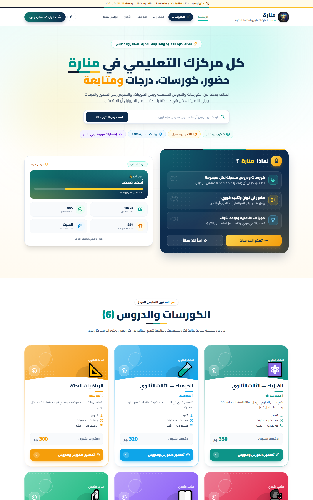
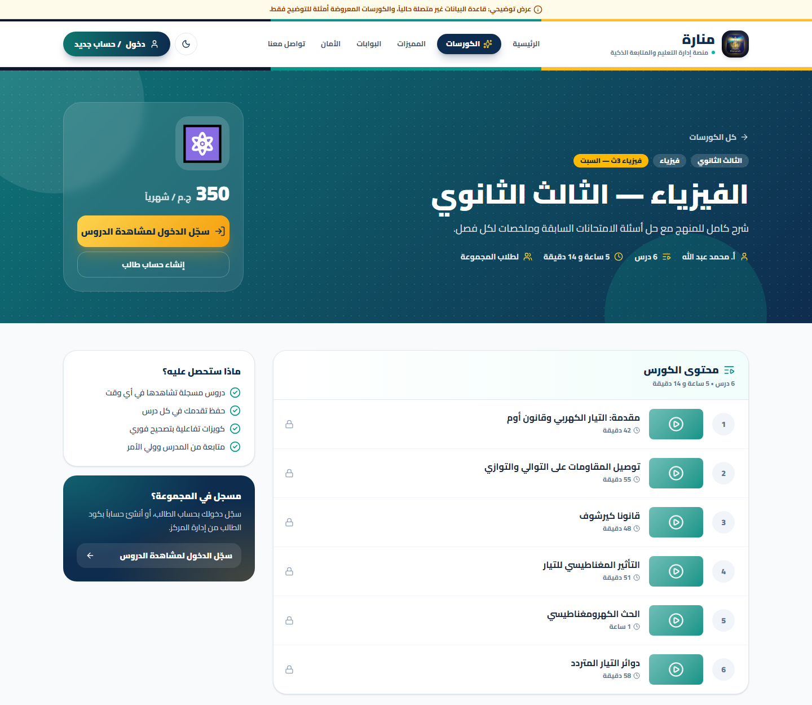
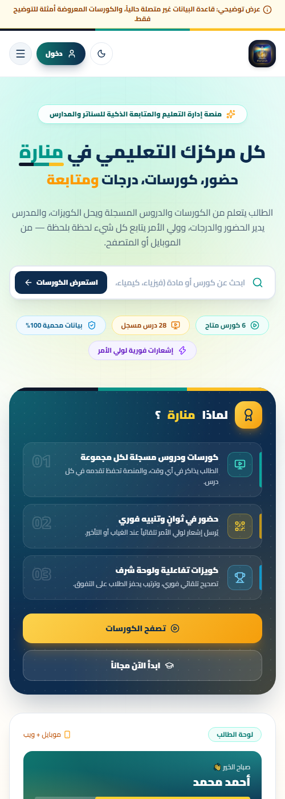
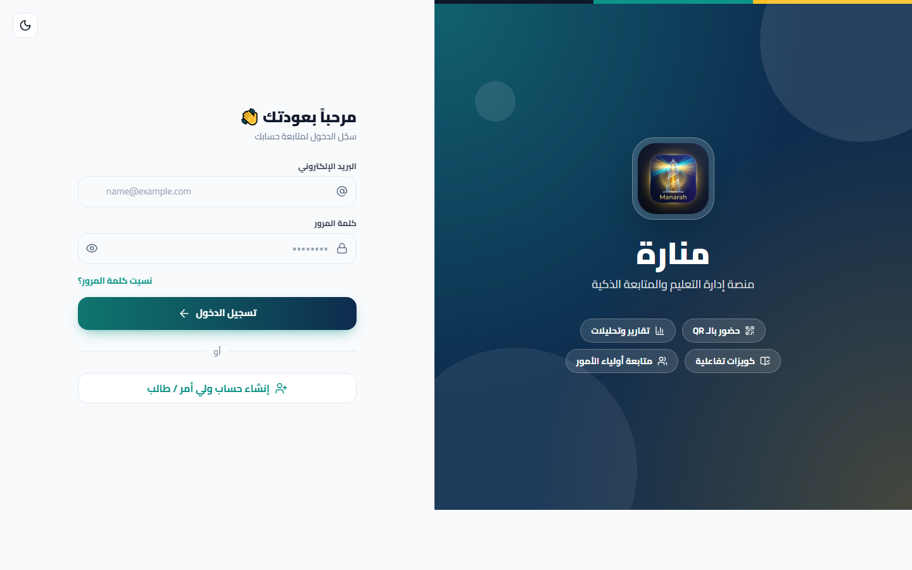
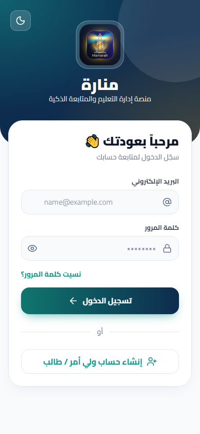

<div align="center">


# منارة — منصة إدارة التعليم والمتابعة الذكية (نسخة الويب)

**موقع كامل للسناتر والمدارس: الإدارة والمدرسين والمساعدين، الطالب، وولي الأمر — على نفس قاعدة بيانات تطبيق الموبايل.**


</div>

---

## لقطات

<p align="center">
  
</p>

<table>
  <tr>
    <td width="70%"></td>
    <td width="30%"></td>
  </tr>
  <tr>
    <td></td>
    <td></td>
  </tr>
</table>

> **وضع العرض التوضيحي:** لو قاعدة البيانات غير متصلة، الموقع يعرض كورسات ودروس نموذجية مع شريط أصفر واضح
> «عرض توضيحي» — وبمجرد ربط مشروع Supabase تظهر الكورسات الحقيقية تلقائياً.

## المميزات

| | |
|---|---|
| 🎨 **هوية بصرية موحدة** | نفس ألوان أكاديمية هير خالد: تيل، ذهبي، كحلي، مع شريط الهوية الثلاثي |
| 📚 **كورسات ودروس للزوار** | صفحة `/courses` وصفحة لكل كورس بقائمة دروسه — بدون روابط الفيديو، والمشاهدة للطلاب المسجلين فقط |
| 🔐 **نفس الحسابات والبيانات** | يعمل على مشروع Supabase الخاص بتطبيق الموبايل `attendance_pro` — أي تعديل من الموقع يظهر في التطبيق فوراً والعكس |
| 🛡️ **أمان من قاعدة البيانات** | كل صلاحية محمية بـ Row Level Security؛ ولي الأمر لا يرى إلا أبناءه والمساعد لا يرى إلا ما سمح به المدرس |
| 📱 **متجاوب بالكامل** | قائمة جانبية على الكمبيوتر، وشريط سفلي عائم على الموبايل |
| 🌙 **وضع ليلي** | يتذكر اختيار المستخدم، وبدون وميض عند فتح الصفحة |
| ⚡ **لحظي** | الإشعارات والرسائل وشاشة الحضور بالـ QR تتحدث مباشرة (Supabase Realtime) |

### لوحة الإدارة / المدرسين / المساعدين — `/admin`
- **نظرة عامة**: ملخص اليوم، حصص اليوم، تنبيهات الغياب المتكرر مع إشعار وواتساب لولي الأمر
- **الحضور**: كشف يدوي بالحالات (حاضر/غائب/متأخر/بعذر) + ملاحظات، و**شاشة QR متغيرة كل 5 ثوانٍ** ضد الغش مع عداد حضور مباشر
- **الطلاب**: بحث وفلاتر، إضافة، **استيراد وتصدير Excel**، وصفحة لكل طالب (تعديل، مجموعات، تجديد اشتراك، دفعات، إشعار، أوسمة، واتساب)
- **المجموعات والجدول**: مواعيد أسبوعية، رسوم، مدرس، رابط جروب واتساب، وعرض أسبوعي
- **الامتحانات والدرجات**: رصد الدرجات بإحصائيات فورية ونشر/إخفاء وتصدير
- **الكويزات التفاعلية**: محرر أسئلة (اختيار من متعدد / صح وخطأ)، توقيت، محاولات، نشر مع إشعار الطلاب، ونتائج
- **الكورسات والدروس**، **المالية** (رسم بياني للإيرادات + المتأخرون)، **الرسائل**، **لوحة الشرف**، **إشعار جماعي**
- **التقارير**: منحنيات الحضور وتصدير تقرير Excel (ملخص + تفاصيل)
- **المدرسون والمساعدون** (إنشاء حسابات، صلاحيات، إيقاف، كلمة مرور)، **مراقبة المحادثات**، **إعدادات المركز** (بما فيها نطاق الموقع للحضور)، **سجل العمليات**

### بوابة الطالب — `/student`
الرئيسية، **مسح QR بالكاميرا لتسجيل الحضور**، كورساتي ومشغل الدروس (YouTube / Vimeo / Google Drive)، **حل الكويزات بعداد وقت ومراجعة الإجابات**، الامتحانات، الدرجات (رسم رادار للمواد)، الجدول، الرسائل، الإشعارات.

### بوابة ولي الأمر — `/parent`
متابعة كل ابن: الحضور لحظياً، الدرجات، حالة الاشتراك والمدفوعات، ربط ابن جديد بالكود، الرسائل مع المدرس، الإشعارات.

---

## التشغيل محلياً

المتطلبات: Node.js 20 أو أحدث.

```bash
git clone https://github.com/HEMASAMIR/MANASA_WEB.git
cd MANASA_WEB
npm install
cp .env.example .env.local     # ثم ضع بيانات مشروع Supabase
npm run dev                    # http://localhost:3000
```

ملف `.env.local`:

```env
NEXT_PUBLIC_SUPABASE_URL=https://xxxx.supabase.co
NEXT_PUBLIC_SUPABASE_ANON_KEY=sb_publishable_...   # Project Settings → API
NEXT_PUBLIC_APP_NAME=اسم السنتر
```

> المفتاح العام (anon / publishable) آمن في المتصفح لأن كل الصلاحيات تُفحص داخل قاعدة البيانات.
> **لا تضع مفتاح `service_role` في الموقع أبداً.**

| الأمر | الوظيفة |
|---|---|
| `npm run dev` | تشغيل للتطوير |
| `npm run build` | بناء نسخة الإنتاج |
| `npm start` | تشغيل نسخة الإنتاج |
| `npm run lint` | فحص الكود |

## إعداد Supabase

الموقع يستخدم نفس قاعدة بيانات التطبيق. لو المشروع جديد:

1. نفّذ `supabase/schema.sql` من مستودع التطبيق في **SQL Editor**.
2. انشر دالة `manage-user` (مطلوبة لإنشاء حسابات المدرسين والمساعدين):
   `supabase functions deploy manage-user`
3. أنشئ أول مدير: سجّل حساباً ثم نفّذ `select public.bootstrap_admin('you@example.com');`
4. نفّذ `supabase/public_catalog.sql` (من هذا المستودع) لعرض الكورسات والدروس للزوار في الصفحة الرئيسية و`/courses`.
5. **Authentication → URL Configuration**: ضع رابط الموقع في *Site URL*، وأضف إلى *Redirect URLs*:
   - `https://your-domain.com/login`
   - `https://your-domain.com/reset-password`

## النشر على Vercel

1. من [vercel.com/new](https://vercel.com/new) اختر هذا المستودع.
2. أضف متغيرات البيئة الثلاثة.
3. **Deploy** — ثم أضف رابط الموقع في إعدادات Supabase (الخطوة 5 أعلاه).

## هيكل المشروع

```
src/
├── app/
│   ├── page.tsx              الصفحة الرئيسية
│   ├── courses/              الكورسات وصفحة كل كورس (عامة للزوار)
│   ├── login/ register/ forgot-password/ reset-password/
│   ├── admin/                لوحة الإدارة (20 صفحة)
│   ├── student/              بوابة الطالب
│   └── parent/               بوابة ولي الأمر
├── components/
│   ├── ui.tsx                مكتبة الواجهة (أزرار، كروت، نوافذ، تنبيهات...)
│   ├── shell.tsx             إطار البوابات (القائمة، الشريط العلوي، حماية المسارات)
│   └── shared.tsx            الرسائل، الإشعارات، الملف الشخصي
└── lib/
    ├── api.ts                كل استعلامات Supabase (مطابقة لمستودعات تطبيق Flutter)
    ├── auth.tsx              الجلسة والصلاحيات
    └── student.tsx           تجميع بيانات بوابة الطالب
```
